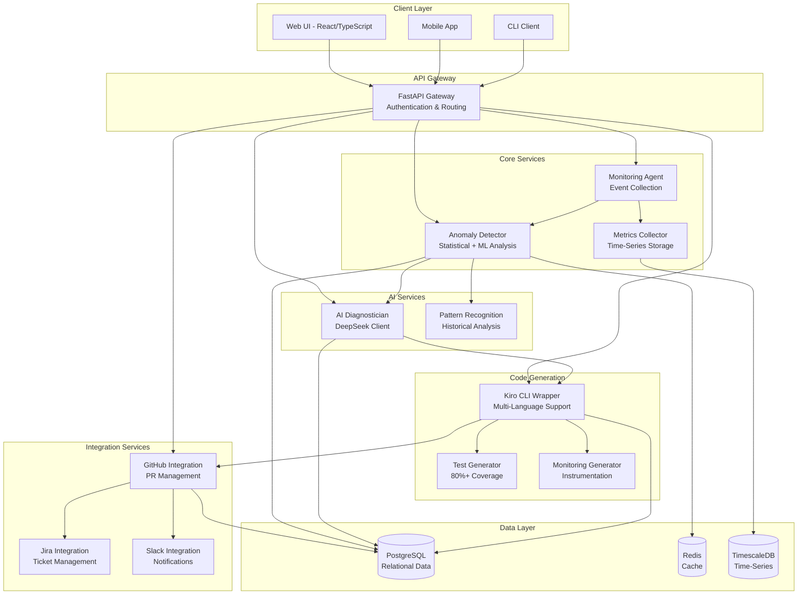
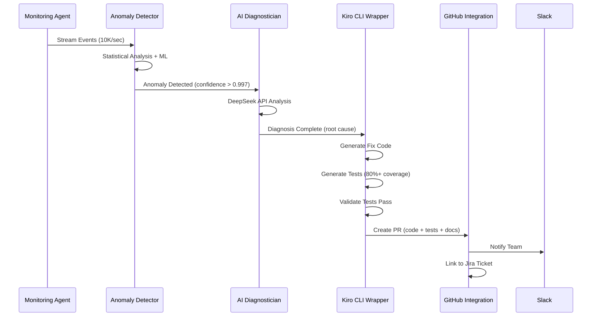

# Design Document: VigilAI Monitoring Platform

## Overview

VigilAI is an intelligent system monitoring platform that combines real-time anomaly detection, AI-powered diagnosis, and automated code generation. The system follows an event-driven architecture with microservices handling distinct responsibilities: monitoring and data collection, anomaly detection using statistical and ML models, AI-powered diagnosis via DeepSeek API, automated code generation through Kiro CLI, and GitHub PR management.

The platform is designed for high throughput (10K+ events/second), low latency (<100ms p95), and high availability (99.9% uptime). It supports multiple programming languages (JavaScript, Python, Go, Java, TypeScript, Ruby) and integrates with development tools (GitHub, Jira, Slack).

### Key Design Principles

1. **Event-Driven Architecture**: Asynchronous processing for scalability and resilience
2. **Separation of Concerns**: Each service has a single, well-defined responsibility
3. **Fail-Safe Design**: Graceful degradation when components fail
4. **Multi-Language Support**: Language-agnostic core with language-specific adapters
5. **Observability First**: Comprehensive metrics, logging, and tracing

## Architecture

### System Architecture Diagram



### Component Interaction Flow



## Components and Interfaces

### 1. Monitoring Agent

**Responsibility**: Collect metrics, logs, and errors from production systems

**Key Functions**:
- `collect_metrics()`: Gather system metrics (CPU, memory, disk, network)
- `collect_logs()`: Stream application logs
- `collect_errors()`: Capture error traces and stack traces
- `emit_event(event: Event)`: Send normalized events to Anomaly Detector

**Interfaces**:
```python
class MonitoringAgent:
    def collect_metrics(self, sources: List[str]) -> Iterator[Metric]
    def collect_logs(self, sources: List[str]) -> Iterator[LogEntry]
    def collect_errors(self, sources: List[str]) -> Iterator[ErrorTrace]
    def emit_event(self, event: Event) -> None
    def configure_sources(self, config: MonitoringConfig) -> None
```

**Performance Requirements**:
- Process 10,000+ events/second
- <10ms overhead per event
- Buffer up to 100K events during downstream failures

### 2. Anomaly Detector

**Responsibility**: Identify abnormal patterns using statistical analysis and ML models

**Detection Algorithms**:
- **Z-Score Analysis**: Detect outliers beyond 3 standard deviations
- **Interquartile Range (IQR)**: Identify values outside Q1-1.5*IQR to Q3+1.5*IQR
- **Moving Average**: Compare current values to rolling window averages
- **Isolation Forest**: ML-based anomaly detection for multivariate data
- **LSTM Autoencoder**: Deep learning for temporal pattern anomalies

**Key Functions**:
- `analyze_event(event: Event)`: Process single event through detection pipeline
- `calculate_confidence(scores: List[float])`: Aggregate confidence from multiple algorithms
- `classify_anomaly(confidence: float)`: Determine if event is anomalous (threshold: 0.997)
- `enrich_anomaly(anomaly: Anomaly)`: Add context and historical patterns

**Interfaces**:
```python
class AnomalyDetector:
    def analyze_event(self, event: Event) -> DetectionResult
    def calculate_confidence(self, scores: List[float]) -> float
    def classify_anomaly(self, confidence: float) -> bool
    def enrich_anomaly(self, anomaly: Anomaly) -> EnrichedAnomaly
    def update_baseline(self, events: List[Event]) -> None
```

**Performance Requirements**:
- <100ms processing time per event (p95)
- Handle 10,000 events/second
- 99.7% confidence threshold for anomaly classification

### 3. AI Diagnostician

**Responsibility**: Analyze anomalies and determine root causes using AI

**Analysis Pipeline**:
1. **Context Gathering**: Collect related logs, traces, and metrics
2. **Pattern Matching**: Compare against known issue patterns
3. **AI Analysis**: Send to DeepSeek API with structured prompt
4. **Fallback**: Use GPT-4 if DeepSeek unavailable
5. **Validation**: Verify diagnosis coherence and actionability

**Key Functions**:
- `diagnose_anomaly(anomaly: EnrichedAnomaly)`: Generate root cause analysis
- `gather_context(anomaly: Anomaly)`: Collect related system data
- `call_deepseek_api(prompt: str)`: Primary AI analysis
- `call_gpt4_fallback(prompt: str)`: Backup AI analysis
- `validate_diagnosis(diagnosis: Diagnosis)`: Ensure quality and actionability

**Interfaces**:
```python
class AIDiagnostician:
    def diagnose_anomaly(self, anomaly: EnrichedAnomaly) -> Diagnosis
    def gather_context(self, anomaly: Anomaly) -> DiagnosisContext
    def call_deepseek_api(self, prompt: str, context: DiagnosisContext) -> AIResponse
    def call_gpt4_fallback(self, prompt: str, context: DiagnosisContext) -> AIResponse
    def validate_diagnosis(self, diagnosis: Diagnosis) -> ValidationResult
```

**Performance Requirements**:
- <2 minutes diagnosis time
- 89%+ accuracy in root cause identification
- Automatic fallback to GPT-4 within 5 seconds

### 4. Kiro CLI Wrapper

**Responsibility**: Generate production-ready code fixes using Kiro CLI

**Code Generation Pipeline**:
1. **Language Detection**: Identify programming language and framework
2. **Context Preparation**: Prepare codebase context for Kiro
3. **Fix Generation**: Use Kiro CLI to generate fix code
4. **Test Generation**: Generate tests with 80%+ coverage
5. **Monitoring Generation**: Add instrumentation and alerts
6. **Validation**: Run tests and verify all pass

**Key Functions**:
- `detect_language(repo_path: str)`: Identify language and framework
- `generate_fix(diagnosis: Diagnosis, repo_path: str)`: Create fix code
- `generate_tests(fix: Fix, coverage_target: float)`: Create test suite
- `generate_monitoring(fix: Fix)`: Add instrumentation
- `validate_fix(fix: Fix)`: Run tests and verify

**Interfaces**:
```python
class KiroCLIWrapper:
    def detect_language(self, repo_path: str) -> LanguageInfo
    def generate_fix(self, diagnosis: Diagnosis, repo_path: str) -> Fix
    def generate_tests(self, fix: Fix, coverage_target: float) -> TestSuite
    def generate_monitoring(self, fix: Fix) -> MonitoringConfig
    def validate_fix(self, fix: Fix) -> ValidationResult
    def get_kiro_version(self) -> str
```

**Supported Languages**:
- JavaScript (Node.js, React, Vue, Angular)
- Python (Django, Flask, FastAPI)
- Go (standard library, Gin, Echo)
- Java (Spring Boot, Micronaut)
- TypeScript (Node.js, React, Angular)
- Ruby (Rails, Sinatra)

### 5. PR Manager (GitHub Integration)

**Responsibility**: Create and manage GitHub pull requests

**PR Creation Pipeline**:
1. **Branch Creation**: Create feature branch from main/master
2. **Commit Generation**: Commit fix code, tests, and monitoring
3. **PR Description**: Generate detailed description with context
4. **PR Creation**: Submit PR via GitHub API
5. **Notification**: Alert team via Slack and update Jira

**Key Functions**:
- `create_branch(repo: str, base: str)`: Create feature branch
- `commit_changes(branch: str, files: List[File])`: Commit fix files
- `generate_pr_description(diagnosis: Diagnosis, fix: Fix)`: Create PR body
- `create_pull_request(pr: PullRequest)`: Submit PR via API
- `link_to_jira(pr: PullRequest, ticket: str)`: Associate with Jira ticket

**Interfaces**:
```python
class PRManager:
    def create_branch(self, repo: str, base: str, name: str) -> Branch
    def commit_changes(self, branch: Branch, files: List[File], message: str) -> Commit
    def generate_pr_description(self, diagnosis: Diagnosis, fix: Fix) -> str
    def create_pull_request(self, pr: PullRequest) -> PullRequestResponse
    def link_to_jira(self, pr: PullRequest, ticket: str) -> None
```

### 6. Integration Services

**Jira Integration**:
- Create tickets when anomalies detected
- Update tickets with diagnosis and PR links
- Close tickets when fixes merged

**Slack Integration**:
- Send anomaly alerts to configured channels
- Post diagnosis summaries
- Notify team when PRs created
- Support threaded conversations for context

**Interfaces**:
```python
class JiraIntegration:
    def create_ticket(self, anomaly: Anomaly, diagnosis: Diagnosis) -> JiraTicket
    def update_ticket(self, ticket_id: str, update: TicketUpdate) -> None
    def close_ticket(self, ticket_id: str, resolution: str) -> None

class SlackIntegration:
    def send_alert(self, channel: str, anomaly: Anomaly) -> MessageResponse
    def post_diagnosis(self, channel: str, diagnosis: Diagnosis) -> MessageResponse
    def notify_pr_created(self, channel: str, pr: PullRequest) -> MessageResponse
```

## Data Models

### Event Schema

```python
@dataclass
class Event:
    id: UUID
    timestamp: datetime
    source: str  # hostname, service name, etc.
    type: EventType  # METRIC, LOG, ERROR
    data: Dict[str, Any]  # flexible payload
    metadata: Dict[str, str]  # tags, labels
    
class EventType(Enum):
    METRIC = "metric"
    LOG = "log"
    ERROR = "error"
```

### Anomaly Schema

```python
@dataclass
class Anomaly:
    id: UUID
    timestamp: datetime
    event_id: UUID
    metric_name: str
    metric_value: float
    expected_range: Tuple[float, float]
    confidence: float  # 0.0 to 1.0
    status: AnomalyStatus
    detection_algorithms: List[str]  # which algorithms flagged it
    
class AnomalyStatus(Enum):
    DETECTED = "detected"
    DIAGNOSING = "diagnosing"
    FIXING = "fixing"
    PR_CREATED = "pr_created"
    RESOLVED = "resolved"
    FALSE_POSITIVE = "false_positive"
```

### Diagnosis Schema

```python
@dataclass
class Diagnosis:
    id: UUID
    anomaly_id: UUID
    timestamp: datetime
    root_cause: str  # human-readable explanation
    affected_components: List[str]
    confidence: float  # 0.0 to 1.0
    suggested_fix: str  # high-level fix approach
    ai_model: str  # "deepseek" or "gpt4"
    context: DiagnosisContext
    
@dataclass
class DiagnosisContext:
    related_logs: List[LogEntry]
    related_metrics: List[Metric]
    stack_traces: List[str]
    recent_deployments: List[Deployment]
```

### Fix Schema

```python
@dataclass
class Fix:
    id: UUID
    diagnosis_id: UUID
    timestamp: datetime
    language: str
    framework: str
    files: List[FixFile]
    tests: TestSuite
    monitoring: MonitoringConfig
    validation_result: ValidationResult
    
@dataclass
class FixFile:
    path: str
    content: str
    change_type: ChangeType  # CREATE, MODIFY, DELETE
    
class ChangeType(Enum):
    CREATE = "create"
    MODIFY = "modify"
    DELETE = "delete"
```

### Pull Request Schema

```python
@dataclass
class PullRequest:
    id: UUID
    fix_id: UUID
    repository: str
    branch_name: str
    base_branch: str
    title: str
    description: str
    files: List[FixFile]
    status: PRStatus
    github_pr_number: Optional[int]
    github_pr_url: Optional[str]
    jira_ticket_id: Optional[str]
    review_status: ReviewStatus
    
class PRStatus(Enum):
    CREATING = "creating"
    OPEN = "open"
    MERGED = "merged"
    CLOSED = "closed"
    
class ReviewStatus(Enum):
    PENDING = "pending"
    APPROVED = "approved"
    CHANGES_REQUESTED = "changes_requested"
```

### Configuration Schema

```python
@dataclass
class SystemConfiguration:
    id: UUID
    repository: str
    tech_stack: TechStack
    monitoring_config: MonitoringConfig
    alert_thresholds: AlertThresholds
    integrations: IntegrationConfig
    
@dataclass
class TechStack:
    language: str
    framework: str
    version: str
    dependencies: List[Dependency]
    
@dataclass
class AlertThresholds:
    anomaly_confidence: float  # default: 0.997
    diagnosis_confidence: float  # default: 0.85
    max_detection_time: int  # seconds, default: 240
    max_diagnosis_time: int  # seconds, default: 120
```


## API Design

### REST API Endpoints

#### Anomaly Detection API

**POST /api/v1/anomalies/detect**
- Description: Submit events for anomaly detection
- Request Body:
```json
{
  "events": [
    {
      "timestamp": "2024-01-15T10:30:00Z",
      "source": "api-server-01",
      "type": "metric",
      "data": {
        "metric_name": "response_time_ms",
        "value": 1250
      }
    }
  ]
}
```
- Response:
```json
{
  "results": [
    {
      "event_id": "uuid",
      "is_anomaly": true,
      "confidence": 0.998,
      "anomaly_id": "uuid"
    }
  ]
}
```

**GET /api/v1/anomalies**
- Description: List detected anomalies with filtering
- Query Parameters: `status`, `start_date`, `end_date`, `confidence_min`
- Response: Paginated list of anomalies

**GET /api/v1/anomalies/{anomaly_id}**
- Description: Get detailed anomaly information
- Response: Full anomaly object with enriched context

#### Diagnosis API

**POST /api/v1/diagnosis/analyze**
- Description: Trigger AI diagnosis for an anomaly
- Request Body:
```json
{
  "anomaly_id": "uuid",
  "priority": "high"
}
```
- Response:
```json
{
  "diagnosis_id": "uuid",
  "status": "processing",
  "estimated_completion": "2024-01-15T10:32:00Z"
}
```

**GET /api/v1/diagnosis/{diagnosis_id}**
- Description: Get diagnosis results
- Response: Full diagnosis object with root cause and suggested fix

#### Code Generation API

**POST /api/v1/code/generate**
- Description: Generate code fix from diagnosis
- Request Body:
```json
{
  "diagnosis_id": "uuid",
  "repository": "org/repo",
  "target_branch": "main"
}
```
- Response:
```json
{
  "fix_id": "uuid",
  "status": "generating",
  "estimated_completion": "2024-01-15T10:35:00Z"
}
```

**GET /api/v1/code/fixes/{fix_id}**
- Description: Get generated fix details
- Response: Fix object with code, tests, and validation results

#### GitHub Integration API

**POST /api/v1/github/create-pr**
- Description: Create pull request with generated fix
- Request Body:
```json
{
  "fix_id": "uuid",
  "repository": "org/repo",
  "base_branch": "main",
  "reviewers": ["user1", "user2"]
}
```
- Response:
```json
{
  "pr_id": "uuid",
  "github_pr_number": 123,
  "github_pr_url": "https://github.com/org/repo/pull/123"
}
```

**GET /api/v1/github/prs**
- Description: List pull requests created by VigilAI
- Query Parameters: `status`, `repository`, `start_date`, `end_date`
- Response: Paginated list of pull requests

#### Dashboard and Metrics API

**GET /api/v1/dashboard/metrics**
- Description: Get dashboard metrics and statistics
- Query Parameters: `start_date`, `end_date`, `granularity`
- Response:
```json
{
  "total_anomalies": 145,
  "total_diagnoses": 142,
  "total_fixes": 138,
  "total_prs": 135,
  "average_mttr_seconds": 420,
  "mttr_reduction_percent": 87.5,
  "fix_success_rate": 0.94
}
```

**GET /api/v1/dashboard/trends**
- Description: Get time-series trends for key metrics
- Response: Time-series data for anomalies, MTTR, fix success rate

### API Authentication

All API endpoints require authentication via:
- **OAuth2 Bearer Token**: For user-initiated requests
- **API Key**: For service-to-service communication

Headers:
```
Authorization: Bearer <token>
# OR
X-API-Key: <api_key>
```

### API Rate Limiting

- **Authenticated Users**: 1000 requests/hour
- **API Keys**: 10000 requests/hour
- **Burst Limit**: 100 requests/minute

Rate limit headers:
```
X-RateLimit-Limit: 1000
X-RateLimit-Remaining: 847
X-RateLimit-Reset: 1642248000
```

## Integration Patterns

### Event-Driven Architecture

**Message Queue**: RabbitMQ or Apache Kafka for event streaming

**Event Flow**:
1. Monitoring Agent → Event Queue → Anomaly Detector
2. Anomaly Detector → Anomaly Queue → AI Diagnostician
3. AI Diagnostician → Diagnosis Queue → Kiro CLI Wrapper
4. Kiro CLI Wrapper → Fix Queue → PR Manager

**Benefits**:
- Decoupling of services
- Horizontal scalability
- Fault tolerance (messages persist during failures)
- Replay capability for debugging

### Request-Response Pattern

Used for synchronous operations:
- API Gateway → Core Services
- User queries to dashboard
- GitHub API calls

### Async Job Queue

**Job Queue**: Celery with Redis backend

**Long-Running Tasks**:
- AI diagnosis (up to 2 minutes)
- Code generation (up to 5 minutes)
- Test execution (variable duration)

**Job Status Tracking**:
```python
{
  "job_id": "uuid",
  "status": "processing",  # queued, processing, completed, failed
  "progress": 0.65,
  "result": null,
  "error": null
}
```

### Webhook Callbacks

**GitHub Webhooks**:
- PR status changes (opened, merged, closed)
- Review status changes (approved, changes requested)
- CI/CD status updates

**Jira Webhooks**:
- Ticket status changes
- Comment additions

**Slack Webhooks**:
- Outgoing webhooks for notifications
- Slash commands for queries

## Security Design

### Authentication

**OAuth2 Flow**:
1. User redirects to OAuth provider (GitHub, Google, etc.)
2. User authorizes VigilAI
3. OAuth provider returns authorization code
4. VigilAI exchanges code for access token
5. Access token used for subsequent API calls

**API Key Management**:
- Generated per service/integration
- Stored encrypted in database (AES-256)
- Rotatable without service interruption
- Scoped permissions (read-only, write, admin)

### Authorization

**Role-Based Access Control (RBAC)**:

Roles:
- **Viewer**: Read-only access to anomalies and diagnoses
- **Developer**: Can trigger diagnoses and view fixes
- **Engineer**: Can generate fixes and create PRs
- **Admin**: Full access including configuration

Permissions Matrix:
```
| Resource        | Viewer | Developer | Engineer | Admin |
|-----------------|--------|-----------|----------|-------|
| View Anomalies  | ✓      | ✓         | ✓        | ✓     |
| Trigger Diagnosis| ✗     | ✓         | ✓        | ✓     |
| Generate Fix    | ✗      | ✗         | ✓        | ✓     |
| Create PR       | ✗      | ✗         | ✓        | ✓     |
| Configure System| ✗      | ✗         | ✗        | ✓     |
```

### Encryption

**Data at Rest**:
- Database encryption: PostgreSQL transparent data encryption (TDE)
- Credentials: AES-256 encryption with key rotation
- Secrets: HashiCorp Vault or AWS Secrets Manager

**Data in Transit**:
- TLS 1.3 for all external communication
- mTLS for service-to-service communication
- Certificate pinning for critical integrations

### Security Best Practices

1. **Input Validation**: Validate all API inputs against schemas
2. **SQL Injection Prevention**: Use parameterized queries
3. **XSS Prevention**: Sanitize all user-generated content
4. **CSRF Protection**: Use CSRF tokens for state-changing operations
5. **Audit Logging**: Log all security-relevant events
6. **Secrets Management**: Never store secrets in code or config files
7. **Dependency Scanning**: Regular vulnerability scans of dependencies

## Deployment Architecture

### Containerization

**Docker Images**:
- `vigilai/api-gateway`: FastAPI gateway service
- `vigilai/monitoring-agent`: Event collection service
- `vigilai/anomaly-detector`: Detection service
- `vigilai/ai-diagnostician`: Diagnosis service
- `vigilai/kiro-wrapper`: Code generation service
- `vigilai/pr-manager`: GitHub integration service
- `vigilai/web-ui`: React frontend

**Base Image**: Python 3.10-slim or Node 18-alpine

**Image Optimization**:
- Multi-stage builds to minimize size
- Layer caching for faster builds
- Security scanning with Trivy

### Kubernetes Deployment

**Namespace**: `vigilai-production`

**Deployments**:
```yaml
apiVersion: apps/v1
kind: Deployment
metadata:
  name: api-gateway
spec:
  replicas: 3
  selector:
    matchLabels:
      app: api-gateway
  template:
    metadata:
      labels:
        app: api-gateway
    spec:
      containers:
      - name: api-gateway
        image: vigilai/api-gateway:latest
        ports:
        - containerPort: 8000
        resources:
          requests:
            memory: "256Mi"
            cpu: "250m"
          limits:
            memory: "512Mi"
            cpu: "500m"
        livenessProbe:
          httpGet:
            path: /health/live
            port: 8000
          initialDelaySeconds: 30
          periodSeconds: 10
        readinessProbe:
          httpGet:
            path: /health/ready
            port: 8000
          initialDelaySeconds: 10
          periodSeconds: 5
```

**Services**:
- LoadBalancer for API Gateway (external access)
- ClusterIP for internal services
- Headless services for stateful components

**Horizontal Pod Autoscaling**:
```yaml
apiVersion: autoscaling/v2
kind: HorizontalPodAutoscaler
metadata:
  name: api-gateway-hpa
spec:
  scaleTargetRef:
    apiVersion: apps/v1
    kind: Deployment
    name: api-gateway
  minReplicas: 3
  maxReplicas: 10
  metrics:
  - type: Resource
    resource:
      name: cpu
      target:
        type: Utilization
        averageUtilization: 70
  - type: Resource
    resource:
      name: memory
      target:
        type: Utilization
        averageUtilization: 80
```

### Load Balancing

**NGINX Ingress Controller**:
- SSL/TLS termination
- Path-based routing
- Rate limiting
- Request buffering

**Configuration**:
```nginx
upstream api_backend {
    least_conn;
    server api-gateway-1:8000;
    server api-gateway-2:8000;
    server api-gateway-3:8000;
}

server {
    listen 443 ssl http2;
    server_name api.vigilai.com;
    
    ssl_certificate /etc/ssl/certs/vigilai.crt;
    ssl_certificate_key /etc/ssl/private/vigilai.key;
    
    location /api/ {
        proxy_pass http://api_backend;
        proxy_set_header Host $host;
        proxy_set_header X-Real-IP $remote_addr;
        proxy_set_header X-Forwarded-For $proxy_add_x_forwarded_for;
    }
}
```

### Multi-Region Support

**Architecture**:
- Active-Active deployment in multiple regions
- Regional data centers with local databases
- Cross-region replication for critical data
- GeoDNS for routing users to nearest region

**Regions**:
- US-East (Primary)
- US-West (Secondary)
- EU-West (Secondary)
- Asia-Pacific (Secondary)

### Database Deployment

**PostgreSQL**:
- Primary-Replica setup for high availability
- Automated failover with Patroni
- Connection pooling with PgBouncer
- Regular backups to S3-compatible storage

**Redis**:
- Redis Sentinel for high availability
- Master-Replica replication
- Persistence with AOF (Append-Only File)

**TimescaleDB**:
- Hypertable partitioning for time-series data
- Continuous aggregates for fast queries
- Data retention policies (90 days)

## Monitoring Strategy

### Metrics Collection

**Prometheus Metrics**:

Application Metrics:
- `vigilai_events_processed_total`: Counter of processed events
- `vigilai_anomalies_detected_total`: Counter of detected anomalies
- `vigilai_diagnosis_duration_seconds`: Histogram of diagnosis times
- `vigilai_fix_generation_duration_seconds`: Histogram of fix generation times
- `vigilai_api_request_duration_seconds`: Histogram of API response times
- `vigilai_api_requests_total`: Counter of API requests by endpoint and status

System Metrics:
- `vigilai_cpu_usage_percent`: CPU utilization
- `vigilai_memory_usage_bytes`: Memory consumption
- `vigilai_disk_usage_bytes`: Disk space usage
- `vigilai_network_bytes_total`: Network traffic

Business Metrics:
- `vigilai_mttr_seconds`: Mean Time To Resolution
- `vigilai_fix_success_rate`: Percentage of successful fixes
- `vigilai_pr_merge_rate`: Percentage of PRs merged

### Visualization

**Grafana Dashboards**:

1. **System Overview Dashboard**:
   - Total anomalies detected (24h, 7d, 30d)
   - Average MTTR trend
   - Fix success rate
   - Active incidents

2. **Performance Dashboard**:
   - API latency (p50, p95, p99)
   - Event processing throughput
   - Database query performance
   - Cache hit rates

3. **Anomaly Trends Dashboard**:
   - Anomalies by type (metric, log, error)
   - Anomalies by service
   - Detection confidence distribution
   - False positive rate

4. **AI Performance Dashboard**:
   - Diagnosis accuracy over time
   - AI model response times
   - DeepSeek vs GPT-4 usage
   - Diagnosis confidence distribution

### Error Tracking

**Sentry Integration**:
- Automatic error capture and grouping
- Stack trace analysis
- Release tracking
- Performance monitoring

**Error Categories**:
- API errors (4xx, 5xx)
- AI service failures
- Code generation failures
- Integration failures (GitHub, Jira, Slack)

### Alerting

**Alert Rules**:

Critical Alerts:
- API error rate > 5% for 5 minutes
- Anomaly detection latency > 200ms (p95) for 10 minutes
- Database connection failures
- AI service unavailable for > 1 minute

Warning Alerts:
- Event processing backlog > 10K events
- Diagnosis accuracy < 85% over 1 hour
- Fix generation failures > 10% over 1 hour
- Disk usage > 80%

**Alert Channels**:
- PagerDuty for critical alerts
- Slack for warning alerts
- Email for daily summaries

### Logging

**Structured Logging**:
```json
{
  "timestamp": "2024-01-15T10:30:00Z",
  "level": "INFO",
  "service": "anomaly-detector",
  "correlation_id": "uuid",
  "message": "Anomaly detected",
  "context": {
    "anomaly_id": "uuid",
    "confidence": 0.998,
    "metric_name": "response_time_ms"
  }
}
```

**Log Aggregation**:
- ELK Stack (Elasticsearch, Logstash, Kibana)
- Centralized logging for all services
- Log retention: 30 days
- Full-text search and filtering

### Distributed Tracing

**OpenTelemetry Integration**:
- Trace requests across all services
- Identify bottlenecks and latency sources
- Visualize service dependencies
- Correlate traces with logs and metrics

**Trace Example**:
```
Request: POST /api/v1/anomalies/detect
├─ api-gateway (5ms)
├─ anomaly-detector (85ms)
│  ├─ z-score-analysis (20ms)
│  ├─ iqr-analysis (15ms)
│  ├─ isolation-forest (40ms)
│  └─ confidence-calculation (10ms)
└─ database-write (8ms)
Total: 98ms
```


## Correctness Properties

A property is a characteristic or behavior that should hold true across all valid executions of a system—essentially, a formal statement about what the system should do. Properties serve as the bridge between human-readable specifications and machine-verifiable correctness guarantees.

### Property 1: Event Processing Time Bound

*For any* event received by the Monitoring Agent, the Anomaly Detector should process it and return a result within 100 milliseconds.

**Validates: Requirements 1.1**

### Property 2: Anomaly Alert Timing

*For any* event that triggers an anomaly detection, the system should generate an alert within 4 minutes of the initial event timestamp.

**Validates: Requirements 1.2**

### Property 3: Confidence Score Range Invariant

*For any* event evaluated by the Anomaly Detector, the assigned confidence score should always be in the range [0.0, 1.0].

**Validates: Requirements 1.3**

### Property 4: Anomaly Classification Threshold

*For any* event with a confidence score of 0.997 or higher, the Anomaly Detector should classify it as an anomaly; for any event with a confidence score below 0.997, it should not be classified as an anomaly.

**Validates: Requirements 1.4**

### Property 5: Diagnosis Time Bound

*For any* detected anomaly, the AI Diagnostician should generate a diagnosis within 2 minutes.

**Validates: Requirements 2.1**

### Property 6: Primary AI Service Selection

*For any* diagnosis request when the DeepSeek API is available, the system should use DeepSeek as the primary analysis engine.

**Validates: Requirements 2.2**

### Property 7: AI Service Fallback

*For any* diagnosis request when the DeepSeek API is unavailable or returns an error, the system should automatically fall back to using GPT-4.

**Validates: Requirements 2.3**

### Property 8: Diagnosis Completeness

*For any* completed diagnosis, the result should include all required fields: root cause, affected components, and recommended fix approach.

**Validates: Requirements 2.4**

### Property 9: Fix Generation Trigger

*For any* completed diagnosis, the Code Generator should automatically trigger fix generation using the Kiro CLI.

**Validates: Requirements 3.1**

### Property 10: Multi-Language Code Generation

*For any* diagnosis where the target codebase is in JavaScript, Python, Go, Java, TypeScript, or Ruby, the Code Generator should produce code in the correct target language.

**Validates: Requirements 3.2**

### Property 11: Test Coverage Requirement

*For any* generated fix, the accompanying test suite should achieve at least 80% code coverage of the fix code.

**Validates: Requirements 3.3**

### Property 12: Test Validation Gate

*For any* generated fix, if any of the generated tests fail, the system should not create a pull request; only fixes with all tests passing should proceed to PR creation.

**Validates: Requirements 3.4**

### Property 13: Monitoring Instrumentation Inclusion

*For any* generated fix, the code should include monitoring instrumentation and alerting configuration.

**Validates: Requirements 3.5**

### Property 14: PR Creation Trigger

*For any* validated fix (all tests passing), the PR Manager should create a GitHub pull request in the target repository.

**Validates: Requirements 4.1**

### Property 15: Pull Request Completeness

*For any* created pull request, it should include all required components: fix code, tests, documentation, monitoring configuration, and a description containing anomaly details, diagnosis, and fix rationale.

**Validates: Requirements 4.2, 4.3**

### Property 16: Anomaly-PR Traceability

*For any* created pull request, it should contain a link or reference to the original anomaly alert that triggered it.

**Validates: Requirements 4.4**

### Property 17: Language Detection Accuracy

*For any* codebase analyzed by the Code Generator, the system should correctly detect the programming language and framework being used.

**Validates: Requirements 5.2**

### Property 18: Language-Appropriate Tooling

*For any* generated fix in a specific language, the system should use the appropriate testing framework and monitoring instrumentation library for that language.

**Validates: Requirements 5.4, 5.5**

### Property 19: Jira Ticket Lifecycle Management

*For any* detected anomaly, the system should create a Jira ticket; when a PR is created, the ticket should be updated with the PR link; when the PR is merged, the ticket should be closed and the anomaly marked as resolved.

**Validates: Requirements 6.1, 6.2, 14.5**

### Property 20: Slack Notification Completeness

*For any* detected anomaly, completed diagnosis, or created pull request, the system should send a notification to the configured Slack channel with appropriate content (anomaly details, diagnosis summary, or PR link respectively).

**Validates: Requirements 4.5, 6.3, 6.4, 6.5**

### Property 21: Component Fault Tolerance

*For any* component failure in the system, the remaining healthy components should continue processing events without interruption.

**Validates: Requirements 8.2**

### Property 22: Restart Recovery Time

*For any* system restart, the system should resume processing events within 30 seconds.

**Validates: Requirements 8.3**

### Property 23: Checkpoint Recovery

*For any* data loss event, the system should recover from the last persisted checkpoint, ensuring no data is lost beyond the checkpoint.

**Validates: Requirements 8.4**

### Property 24: Error Logging and Alerting

*For any* internal error detected by the system, the error should be logged with full context and an alert should be sent to the operations team.

**Validates: Requirements 8.5**

### Property 25: Authentication Enforcement

*For any* API request without valid OAuth2 token or API key, the system should reject the request with a 401 Unauthorized response; for any request with valid credentials, the system should process it.

**Validates: Requirements 9.1**

### Property 26: Credential Encryption

*For any* credential stored in the database, it should be encrypted using AES-256 encryption.

**Validates: Requirements 9.2**

### Property 27: TLS Version Enforcement

*For any* communication with external services, the system should use TLS 1.3 or higher.

**Validates: Requirements 9.3**

### Property 28: Authorization Enforcement

*For any* user action, the system should verify the user has the required permissions; users without permissions should receive a 403 Forbidden response.

**Validates: Requirements 9.4**

### Property 29: Redis TTL Configuration

*For any* data stored in Redis cache, the system should set an appropriate TTL value to prevent unbounded cache growth.

**Validates: Requirements 10.3**

### Property 30: Data Retention Policy

*For any* event stored in the system, it should be retained for at least 90 days before being eligible for deletion.

**Validates: Requirements 10.4**

### Property 31: Health Check Endpoint Availability

*For any* deployed component, it should expose both liveness and readiness health check endpoints that return appropriate status codes.

**Validates: Requirements 11.4**

### Property 32: JSON Response Format

*For any* API response, the content should be valid JSON that can be parsed without errors.

**Validates: Requirements 12.4**

### Property 33: API Error Handling

*For any* invalid input to an API endpoint, the system should return an appropriate HTTP error status code (4xx) and a structured error message in JSON format.

**Validates: Requirements 12.5**

### Property 34: Metrics Emission Completeness

*For any* event processing, diagnosis generation, or fix creation operation, the system should emit corresponding metrics for throughput, latency, accuracy, processing time, and error rates as appropriate.

**Validates: Requirements 13.2, 13.3, 13.4**

### Property 35: Structured Error Logging

*For any* error or security event, the system should emit a structured log entry containing timestamp, correlation ID, user identity (if applicable), and action details.

**Validates: Requirements 9.5, 13.5**

### Property 36: MTTR Calculation and Recording

*For any* resolved incident, the system should calculate the Mean Time To Resolution (time from anomaly detection to fix merge) and record it for reporting.

**Validates: Requirements 14.1**

### Property 37: Anomaly Recurrence Tracking

*For any* deployed fix, the system should monitor whether the same anomaly recurs within 24 hours and record the recurrence status.

**Validates: Requirements 14.3**

### Property 38: Monthly Report Completeness

*For any* generated monthly report, it should include all required metrics: total incidents, average MTTR, fix success rate, and cost savings.

**Validates: Requirements 14.4**

## Error Handling

### Error Categories

1. **Input Validation Errors**:
   - Invalid event format
   - Missing required fields
   - Out-of-range values
   - Response: 400 Bad Request with detailed error message

2. **Authentication Errors**:
   - Missing credentials
   - Invalid OAuth2 token
   - Expired API key
   - Response: 401 Unauthorized

3. **Authorization Errors**:
   - Insufficient permissions
   - Resource access denied
   - Response: 403 Forbidden

4. **Resource Not Found Errors**:
   - Anomaly ID not found
   - Diagnosis ID not found
   - Repository not found
   - Response: 404 Not Found

5. **External Service Errors**:
   - DeepSeek API unavailable → Fallback to GPT-4
   - GitHub API rate limit → Queue request and retry
   - Jira API timeout → Log error and retry with exponential backoff
   - Slack API error → Log error, don't block main workflow

6. **Internal Service Errors**:
   - Database connection failure → Retry with circuit breaker
   - Redis cache unavailable → Degrade gracefully, skip cache
   - Message queue full → Apply backpressure, slow down event ingestion
   - Response: 503 Service Unavailable

7. **Code Generation Errors**:
   - Kiro CLI failure → Log error, notify team, mark diagnosis as failed
   - Test generation failure → Retry once, then fail gracefully
   - Test execution failure → Don't create PR, notify team

8. **Data Integrity Errors**:
   - Duplicate anomaly detection → Deduplicate based on event ID and timestamp
   - Orphaned diagnosis → Clean up via background job
   - Stale data → Implement TTL and cleanup policies

### Error Handling Strategies

**Retry with Exponential Backoff**:
```python
def retry_with_backoff(func, max_retries=3, base_delay=1):
    for attempt in range(max_retries):
        try:
            return func()
        except RetryableError as e:
            if attempt == max_retries - 1:
                raise
            delay = base_delay * (2 ** attempt)
            time.sleep(delay)
```

**Circuit Breaker Pattern**:
- Open circuit after 5 consecutive failures
- Half-open after 30 seconds to test recovery
- Close circuit after 3 successful requests

**Graceful Degradation**:
- Cache unavailable → Query database directly (slower but functional)
- AI service unavailable → Queue diagnosis for later processing
- Notification service down → Store notifications for retry

**Dead Letter Queue**:
- Failed events moved to DLQ after max retries
- Manual review and reprocessing
- Alerts sent to operations team

### Error Logging

All errors should be logged with:
- Timestamp (ISO 8601 format)
- Correlation ID (for request tracing)
- Error type and message
- Stack trace (for internal errors)
- Context (user ID, resource ID, etc.)
- Severity level (ERROR, CRITICAL)

Example:
```json
{
  "timestamp": "2024-01-15T10:30:00Z",
  "level": "ERROR",
  "correlation_id": "uuid",
  "error_type": "ExternalServiceError",
  "message": "DeepSeek API timeout",
  "context": {
    "anomaly_id": "uuid",
    "service": "ai-diagnostician",
    "retry_attempt": 2
  },
  "stack_trace": "..."
}
```

## Testing Strategy

### Dual Testing Approach

VigilAI requires both unit testing and property-based testing for comprehensive coverage:

**Unit Tests**: Verify specific examples, edge cases, and error conditions
- Specific anomaly detection scenarios
- Integration points between components
- Edge cases (empty events, malformed data)
- Error conditions (API failures, timeouts)

**Property Tests**: Verify universal properties across all inputs
- Universal properties that hold for all inputs
- Comprehensive input coverage through randomization
- Minimum 100 iterations per property test

Together, unit tests catch concrete bugs while property tests verify general correctness.

### Property-Based Testing

**Framework Selection**:
- **Python**: Hypothesis
- **JavaScript/TypeScript**: fast-check
- **Go**: gopter
- **Java**: jqwik
- **Ruby**: Rantly

**Configuration**:
- Minimum 100 iterations per property test (due to randomization)
- Each property test must reference its design document property
- Tag format: `Feature: vigilai-monitoring-platform, Property {number}: {property_text}`

**Example Property Test (Python with Hypothesis)**:
```python
from hypothesis import given, strategies as st
import pytest

@given(st.floats(min_value=0.0, max_value=1.0))
def test_property_3_confidence_score_range(confidence_score):
    """
    Feature: vigilai-monitoring-platform
    Property 3: Confidence Score Range Invariant
    
    For any event evaluated by the Anomaly Detector,
    the assigned confidence score should always be in the range [0.0, 1.0].
    """
    event = create_test_event()
    result = anomaly_detector.analyze_event(event)
    
    assert 0.0 <= result.confidence <= 1.0, \
        f"Confidence score {result.confidence} outside valid range [0.0, 1.0]"

@given(st.floats(min_value=0.997, max_value=1.0))
def test_property_4_anomaly_classification_above_threshold(confidence_score):
    """
    Feature: vigilai-monitoring-platform
    Property 4: Anomaly Classification Threshold
    
    For any event with confidence >= 0.997, should be classified as anomaly.
    """
    event = create_test_event_with_confidence(confidence_score)
    result = anomaly_detector.classify_anomaly(confidence_score)
    
    assert result is True, \
        f"Event with confidence {confidence_score} should be classified as anomaly"

@given(st.floats(min_value=0.0, max_value=0.996))
def test_property_4_anomaly_classification_below_threshold(confidence_score):
    """
    Feature: vigilai-monitoring-platform
    Property 4: Anomaly Classification Threshold
    
    For any event with confidence < 0.997, should not be classified as anomaly.
    """
    result = anomaly_detector.classify_anomaly(confidence_score)
    
    assert result is False, \
        f"Event with confidence {confidence_score} should not be classified as anomaly"
```

### Unit Testing

**Test Organization**:
- One test file per component
- Group related tests in test classes
- Use descriptive test names

**Coverage Requirements**:
- Minimum 80% code coverage
- 100% coverage for critical paths (anomaly detection, diagnosis, fix generation)
- All error handling paths tested

**Example Unit Tests**:
```python
def test_anomaly_detector_handles_empty_event():
    """Test that empty events are rejected with appropriate error."""
    event = Event(id=uuid4(), timestamp=datetime.now(), data={})
    
    with pytest.raises(ValidationError) as exc_info:
        anomaly_detector.analyze_event(event)
    
    assert "data cannot be empty" in str(exc_info.value)

def test_ai_diagnostician_falls_back_to_gpt4():
    """Test fallback to GPT-4 when DeepSeek is unavailable."""
    anomaly = create_test_anomaly()
    
    # Mock DeepSeek to raise an error
    with patch('deepseek_client.analyze', side_effect=ServiceUnavailable()):
        diagnosis = ai_diagnostician.diagnose_anomaly(anomaly)
    
    assert diagnosis.ai_model == "gpt4"
    assert diagnosis.root_cause is not None

def test_pr_manager_includes_all_required_files():
    """Test that PRs include code, tests, docs, and monitoring."""
    fix = create_test_fix()
    pr = pr_manager.create_pull_request(fix)
    
    file_types = {f.path.split('.')[-1] for f in pr.files}
    
    assert 'py' in file_types  # code
    assert 'test.py' in [f.path for f in pr.files]  # tests
    assert 'README.md' in [f.path for f in pr.files]  # docs
    assert 'monitoring.yaml' in [f.path for f in pr.files]  # monitoring
```

### Integration Testing

**Test Scenarios**:
1. End-to-end flow: Event → Anomaly → Diagnosis → Fix → PR
2. External service integration: GitHub, Jira, Slack
3. Database operations: PostgreSQL, Redis, TimescaleDB
4. Message queue: Event streaming and processing

**Test Environment**:
- Docker Compose for local integration tests
- Test containers for databases
- Mock servers for external APIs
- Isolated test data

### Performance Testing

**Load Testing**:
- Simulate 10,000 events/second
- Measure API latency (p50, p95, p99)
- Verify system handles sustained load

**Tools**:
- Locust for load generation
- Prometheus for metrics collection
- Grafana for visualization

**Benchmarks**:
- Event processing: <100ms (p95)
- Anomaly detection: <4 minutes
- Diagnosis generation: <2 minutes
- API response time: <100ms (p95)

### Continuous Integration

**CI Pipeline**:
1. Lint and format check (black, flake8, mypy)
2. Unit tests with coverage report
3. Property tests (100 iterations)
4. Integration tests
5. Security scanning (Bandit, Safety)
6. Docker image build
7. Deploy to staging environment

**Quality Gates**:
- All tests must pass
- Code coverage ≥ 80%
- No critical security vulnerabilities
- No linting errors

